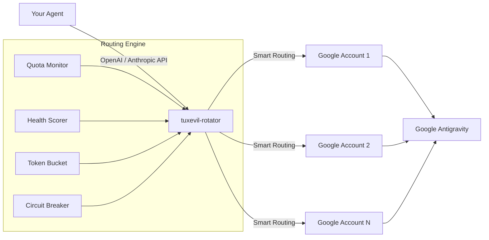

# How It Works

## Proxying

```
Agent 1 (Gemini Pro)  --->  localhost:51200  --->  Account A
Agent 2 (Claude)      --->  localhost:51200  --->  Account C
Agent 3 (Flash)       --->  localhost:51200  --->  Account A
                               (this proxy)          (per-model routing)
```

1. The agent sends a request to `localhost:51200` with a model name in the body
2. The proxy resolves the model to a quota key (e.g., `gemini-3.1-pro`)
3. The best available account for that specific model is selected
4. The `Authorization` header and `project` field are swapped with real credentials
5. The request is forwarded to the configured Antigravity endpoint
6. The SSE response streams back to the agent transparently

## Architecture



## Per-Model Account Selection

Each model maintains its own active account. When the proxy needs to rotate a model, it picks the next account using a priority system:

| Priority | Badge | Condition | Rationale |
|----------|-------|-----------|-----------|
| 1 (first) | `5h` | Short reset window is already active for this model | Drain short-window quota before it recharges |
| 2 | `7d` | Long reset window is already active for this model | Already ticking, so it is still worth using |
| 3 (last) | `fresh` | No active reset window is known for this model yet | Save untouched quota for later if other timed pools exist |

Within the same priority tier, the account with the most remaining quota for that model wins. If multiple accounts tie on priority and quota, rotation advances circularly from the current account so equal candidates share traffic instead of always favoring the first configured match.

**Timer meanings:**

- `fresh` — no future `resetTime` is currently reported for that model on that account. No active reset window is visible in quota polling yet. The dashboard labels this as `idle`.
- `5h` — `resetTime` is less than 6 hours away.
- `7d` — `resetTime` is 6 hours or more away.

## Routing Policies

Six routing policies are available via `routingPolicy` in `accounts.json`:

| Policy | Primary Sort | Description |
|--------|-------------|-------------|
| `timer-first` (default) | Timer priority | Drain 5h windows first, then 7d, then fresh |
| `tier-first` | Account tier | Ultra > Pro > Plus > Free > Unknown |
| `quota-first` | Remaining quota % | Highest remaining quota wins |
| `hybrid` | Composite score | Weighted numeric score combining all factors |
| `sequential-quota` | Circular account order | Walk accounts in configured order, skipping cooldowns and zero-quota pools |
| `sticky-quota` | Preferred account | Keep the current account while it has quota; use a temporary fallback during cooldowns and return when it recovers |

The quota-aware policies do not rotate merely because `requestsPerRotation` was
reached. `sticky-quota` prefers the account already serving the model, while
`sequential-quota` advances to the next eligible account when the current one
cannot serve. A preferred account is discarded when its model quota reaches
zero; cooldowns, circuit breakers, concurrency limits, and transient provider
errors preserve the preference so routing can return to that account after it
recovers. Both policies use the same provider eligibility and quota pools for
Google Antigravity and Ollama Cloud.

The `hybrid` score formula:

```
score = (4 - timerPriority) × 35
      + quota × 0.7
      + (4 - tierRank) × 13.5
      + health × 25
      + tokenRatio × 20
      + max(0, 10 - distance)
```

## Health Scoring

Each account has a health score (0.0 to 1.0) recalculated on each routing decision:

```
healthScore = max(0, min(1,
  quotaAverage / 100
  - min(0.5, consecutiveErrors × 0.1)   // error penalty
  - 0.1 if any cooldowns active           // cooldown penalty
  - 1.0 if flagged / 0.75 if disabled    // availability penalty
))
```

The health score is used as a tiebreaker in all policies and as a weighted factor in `hybrid`. It is visible in the Routing Inspector modal on the dashboard.

## Rotation Triggers

Three mechanisms trigger rotation, scoped to the specific model:

1. **Quota-based** (primary) — Polls the Google quota API every 5 minutes. When a model's remaining quota drops by `rotateOnQuotaDrop` percentage points (default: 20%), that model rotates to the next account. Other models stay on their current accounts.

2. **Request-count** (fallback) — Before forwarding a request, the rotator checks how many requests the current account has already served for that specific model and rotates once it reaches `requestsPerRotation` (default: 5). Per-model counters are persisted so restarts do not reset the threshold. By default this fallback is only used when quota data for that model is still unknown; set `useRequestCountRotationWhenQuotaUnknownOnly` to `false` to keep request-count rotation active even when quota telemetry exists.

3. **429 containment** (reactive) — On provider rate limit, the account is marked exhausted with a parsed retry cooldown and the current request stops. Repeated unique-account 429s trip project/model and model-wide circuit breakers so retries cannot burn through the pool.

## Fresh Windows

The quota polling API only exposes one visible `quotaInfo` block per model. If a model has no visible `resetTime`, the rotator classifies it as `fresh` internally and the dashboard shows it as `idle`.

Operationally, `idle` means:
- no timer window is currently visible for that model in quota polling
- starting that account may open a new quota window
- because the provider does not expose all parallel buckets explicitly, the rotator cannot guarantee ahead of time whether that new visible window will behave like a short `5h` opportunity or a longer `7d` runway

For that reason, the rotator has two operator controls:
- a **global fresh-window toggle** that blocks opening new `idle` windows by default
- a **per-account override** that allows specific accounts to ignore the global block

When fresh-window starts are blocked:
- visible `5h` timers still have highest priority
- visible `7d` timers are still used normally
- `idle` accounts are held back unless you explicitly enable their per-account override

## Account Protection

The proxy detects blocked/suspended accounts at three levels:

1. **Quota API check** (initial poll + every poll) — If the quota API returns `401` or `403`, the account is immediately flagged.

2. **API 401** (on request) — If the upstream endpoint rejects the token with `401 UNAUTHENTICATED`, the account is flagged.

3. **API 403** (on request) — If the response body contains enforcement keywords such as `infring`, `suspend`, `abus`, `terminat`, `violat`, `banned`, `policy`, `forbidden`, or `verif`, the account is flagged.

Flagged accounts are **immediately excluded** from all model routing. If the reason looks serious enough (ToS, abuse, infringement, suspension, or ban language), the rotator also enables a global **protective pause** that stops all routing for `protectivePauseMs` (default: 6 hours). The dashboard shows a red `FLAGGED` badge with the error message and quarantine guidance.

## Circuit Breakers

- **Project circuit breaker** — Pauses a `projectId`+model combination after N unique accounts get 429'd within a rolling window. Prevents cascade-burning sibling accounts on the same project.
- **Model circuit breaker** — Pauses a model globally after N unique accounts across all projects get 429'd. Last-resort safety net.

## Daily Safety Budgets

| Threshold | Default | Effect |
|-----------|---------|--------|
| `dailyAccountSlowRequests` | 250 | Adds 8-25s jitter to each request for that account |
| `dailyAccountStopRequests` | 350 | Stops routing to that account until next UTC day |
| `dailyProjectSlowRequests` | 900 | Adds jitter to all accounts on that project |
| `dailyProjectStopRequests` | 1200 | Stops routing to all accounts on that project until next UTC day |

## Cooldown Management

- Cooldowns are capped at **30 minutes** max
- Stale cooldowns from previous sessions are capped on startup
- When every non-flagged account is cooling down, the routing state becomes `cooldown_wait`
- The dashboard shows why routing is waiting, how long until the next retry window, and which accounts are cooling down
- Quota-based rotation only triggers if a healthy account is available; the proxy won't rotate away from a working account if there's no better alternative

## Error Handling

| Response | Behavior |
|----------|----------|
| `429` | Account marked exhausted with cooldown; request returns `429`/`Retry-After` to force client backoff |
| `401` | Account flagged and excluded from routing |
| `403` with enforcement keywords | Account flagged; may trigger protective pause |
| `503` | Returned to agent when all healthy accounts are cooling down, busy, flagged, or disabled |
| `5xx` other | Account error counter incremented; rotates to next |
